# Automating On-Premise Moodle CBT Deployment using Docker and Shell Scripting

## 🗂️ OBJECTIVE
To:

- Pull a prebuilt Moodle Docker image from **my Docker repository**

- Automatically deploy it along with a **MySQL database** using **Docker Compose**

- Automate the deployment with a **full-featured Bash script**

- Document all steps clearly for future reuse and demonstration

## 🧰 REQUIREMENTS

- **Docker:**	Container engine
- **Docker Compose:**	Manage multi-container app
- **Bash Shell:**	Automate deployment with scripts
- **DockerHub Repo:**	Source of your Moodle image
- **Ubuntu Server:**	On-premise deployment environment

## 📁 FOLDER STRUCTURE

```bash
cbt-moodle-deployment/
├── .env
├── docker-compose.yml
├── install.sh
├── reset.sh
├── backup.sh
├── db-data/
└── moodle-data/   # Will be created by Docker as volume
```

## Create the structure:

## 🔐 STEP 1: `.env` File for Environment Variables

### Create a file called `.env`:

**📌 Purpose:**

This file contains environment variables used across scripts and Docker Compose. It centralizes configurations, so you don’t hard-code passwords or ports.

```bash
# MySQL configuration
MYSQL_ROOT_PASSWORD=cbtrootpass       # Root password for MySQL container
MYSQL_DATABASE=moodle                 # Database name to be created
MYSQL_USER=moodleuser                # MySQL user for Moodle
MYSQL_PASSWORD=moodlepass            # Password for the above user

# Moodle container configuration
MOODLE_PORT=8080                      # Port to access Moodle from browser

# DockerHub image
MOODLE_IMAGE=yourdockerhub/moodle-cbt:latest   # Your custom Moodle Docker image
```

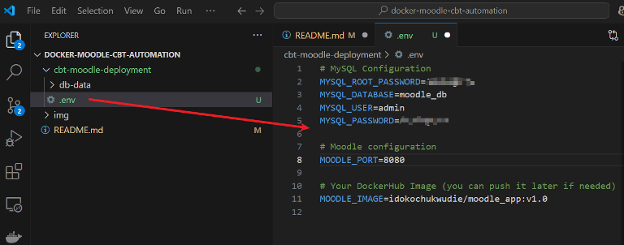

## 🐳 STEP 2: `docker-compose.yml` File

**📌 Purpose:**

This file defines how Docker containers (Moodle and MySQL) will be created, configured, and connected.

```bash
version: '3.8'  # Docker Compose file format version

services:
  db:
    image: mysql:5.7                 # Use MySQL version 5.7
    container_name: moodle_db       # Container name
    restart: always                 # Always restart if container fails
    environment:                    # Pass environment variables from .env file
      MYSQL_ROOT_PASSWORD: ${MYSQL_ROOT_PASSWORD}
      MYSQL_DATABASE: ${MYSQL_DATABASE}
      MYSQL_USER: ${MYSQL_USER}
      MYSQL_PASSWORD: ${MYSQL_PASSWORD}
    volumes:
      - ./db-data:/var/lib/mysql    # Store DB data persistently in host directory

  moodle:
    image: ${MOODLE_IMAGE}           # Pull your Moodle image from DockerHub
    container_name: moodle_web
    depends_on:
      - db                           # Ensure DB starts before Moodle
    ports:
      - "${MOODLE_PORT}:80"          # Map host port to container port 80
    environment:                     # Moodle-specific DB connection variables
      MOODLE_DBTYPE: mysqli
      MOODLE_DBHOST: db              # Internal Docker name of the DB container
      MOODLE_DBNAME: ${MYSQL_DATABASE}
      MOODLE_DBUSER: ${MYSQL_USER}
      MOODLE_DBPASS: ${MYSQL_PASSWORD}
    volumes:
      - moodle-data:/var/www/html    # Volume to persist Moodle files

volumes:
  moodle-data:                       # Declare a named volume for Moodle
```

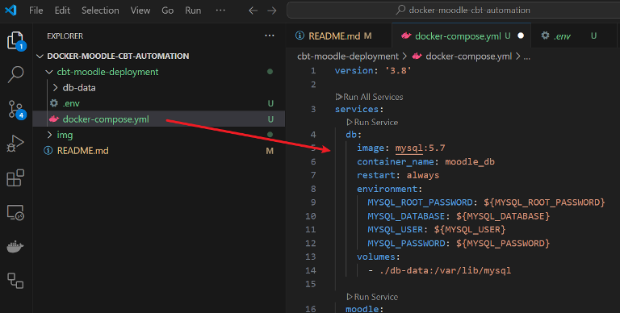

## 🚀 STEP 3: `install.sh` – Automate the Full Deployment

**📌 Purpose:**

Automates the full deployment. It:

- Loads environment variables

- Pulls your DockerHub Moodle image

- Starts services using Docker Compose

```bash
#!/bin/bash

echo "📦 Starting Moodle CBT Deployment..."

# Step 1: Load environment variables from .env file
source .env

# Step 2: Check if Docker is installed
if ! command -v docker &> /dev/null; then
  echo "❌ Docker not installed. Please install Docker."
  exit 1
fi

# Step 3: Check if Docker Compose is installed
if ! command -v docker-compose &> /dev/null; then
  echo "❌ Docker Compose not found. Install it first!"
  exit 1
fi

# Step 4: Pull Moodle image from DockerHub
echo "📥 Pulling Moodle image: $MOODLE_IMAGE"
docker pull $MOODLE_IMAGE

# Step 5: Deploy the containers
echo "🚀 Deploying containers using docker-compose..."
docker-compose up -d

echo "✅ Moodle is running at http://localhost:${MOODLE_PORT}"

chmod +x install.sh
```
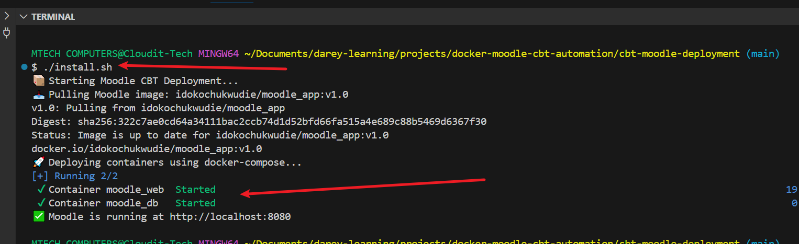

## 🔁 STEP 4: `reset.sh` – Reset Environment

**📌 Purpose:**

Use this script if something goes wrong. It:

- Stops and removes containers

- Deletes MySQL data (optional)

- Redeploys Moodle

```
cat > reset.sh <<'EOF'
#!/bin/bash

echo "🧹 Resetting Moodle CBT Deployment..."

# Stop and remove containers
docker-compose down

# Optionally clear volumes
echo "🧼 Deleting MySQL data..."
rm -rf db-data/*

echo "♻️ Redeploying Moodle..."
./install.sh
EOF

chmod +x reset.sh
```

## 🗄️ STEP 5: `backup.sh` – Backup Moodle + DB Data

**📌 Purpose:**

Backs up Moodle data and MySQL database to a backup folder with date/time stamp.

```
cat > backup.sh <<'EOF'
#!/bin/bash

DATE=$(date +%Y-%m-%d_%H-%M)
BACKUP_DIR="backups/backup_$DATE"
mkdir -p $BACKUP_DIR

echo "📁 Backing up DB and Moodle data..."
cp -r db-data $BACKUP_DIR/
docker run --rm --volumes-from moodle_web -v $(pwd):/backup busybox tar czf /backup/$BACKUP_DIR/moodle-data.tar.gz /var/www/html

echo "✅ Backup complete: $BACKUP_DIR"
EOF

chmod +x backup.sh
```

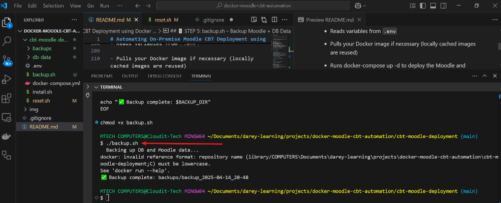


## ✅ Step 7: Verify Deployment

Check if the containers are running:

```bash
docker ps -a
```

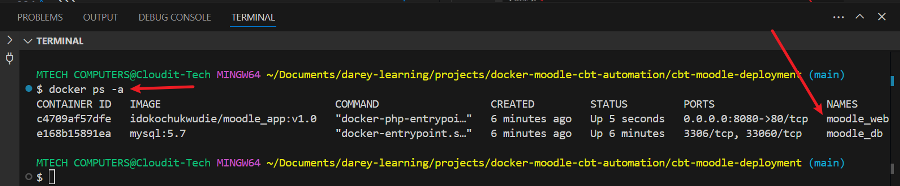

## 🌐 STEP 8: Access Moodle

```cpp
http://localhost:8080
# or use your server's IP if remote:
http://192.168.X.X:8080
```
On first launch, Moodle will guide you through setup (language, admin user, etc.).

## Error

```
Forbidden
You don't have permission to access this resource.
Apache/2.4.54 (Debian) Server at localhost Port 8080
```

means that Apache is running, but it can’t serve the Moodle application properly—usually due to a **file permission issue** or **incorrect Apache configuration** inside the container.

**Let’s fix it step by step.**

**🔍 Step 1:** Check Moodle Data Folder Permissions

Ensure the container has permission to access the mounted Moodle volume.

- Run this from your host machine:

```bash
docker exec -it moodle_web bash
```
- Then, inside the container:

```bash
ls -ld /var/www/html
```
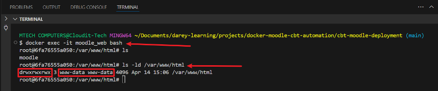

- My moodle folder exists inside /var/www/html ✅

- The permissions are wide open (**drwxrwxrwx**), so access shouldn't be blocked by file permissions ❗

- The folder is owned by www-data, which is what Apache runs as — also ✅

**🔍 Step 2:** Check Apache Site Config

Still inside the container, run:

```bash
cat /etc/apache2/sites-enabled/000-default.conf
```

Look for the block like this:

```
<VirtualHost *:80>
    DocumentRoot /var/www/html
    ...
</VirtualHost>
```

But most importantly, look for:

```
<Directory /var/www/html>
    Options Indexes FollowSymLinks
    AllowOverride All
    Require all granted
</Directory>
```

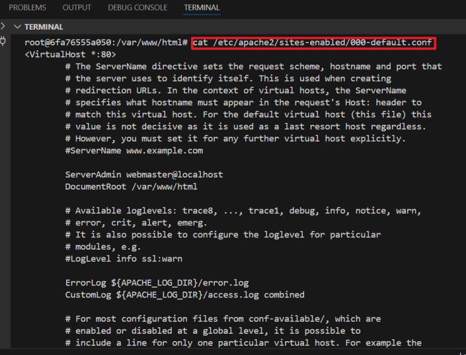

**Directory block missing**

If it’s **missing** or says **Require all denied**, then that’s my problem.

✅ If it's pointing to /var/www/html but your Moodle is in /var/www/html/moodle, Apache doesn't serve it by default unless told to.

**🛠️ Step 3:** Fix `Apache Config`

Let’s tell `Apache` it's allowed to serve the `moodle` folder by adding a `<Directory>` directive.

Still inside your container, edit the config file:

Install Nano

```bash
apt update && apt install nano -y
```

```bash
nano /etc/apache2/sites-available/000-default.conf
```

Update the file to look like this (modified lines are marked with 🔧 for clarity — don’t add those in the real file):

```
<VirtualHost *:80>
        ServerAdmin webmaster@localhost
        DocumentRoot /var/www/html/moodle    # 🔧 Set Moodle as root

        <Directory /var/www/html/moodle>     # 🔧 Allow Apache to serve Moodle
                Options Indexes FollowSymLinks
                AllowOverride All
                Require all granted
        </Directory>

        ErrorLog ${APACHE_LOG_DIR}/error.log
        CustomLog ${APACHE_LOG_DIR}/access.log combined
</VirtualHost>
```

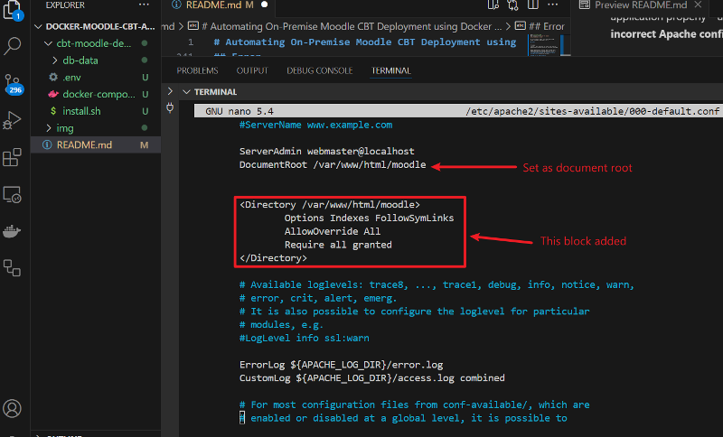

**💾 Save and Exit**
- Press `Ctrl + O` to save

- Press `Enter` to confirm

- Press `Ctrl + X` to exit

### 🔄 Restart Apache

Run:

```bash
service apache2 restart
```

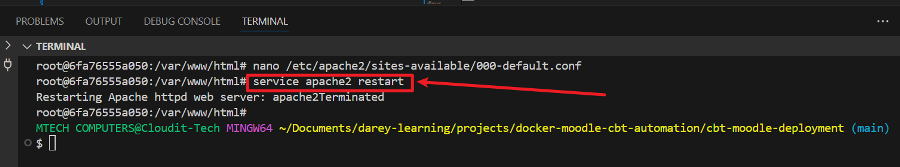

Although it showed `Terminated`, this is normal when restarting services **inside Docker** — Apache restarted, and the process continues in the background.

**If by any chance your container has exited, you can run:**

```bash
docker start <container-id>
```

**🌐 Now Visit Moodle in Browser**

Go to:

```
http://localhost:8080
```

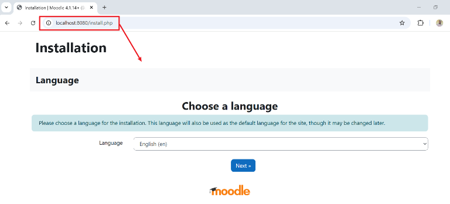

On first launch, Moodle will guide you through setup (language, admin user, etc.).

**NOTE:** Once you reach the stage where you're required to provide database connection details, ensure you supply the exact values from your `.env` file:

- MYSQL_DATABASE value

- MYSQL_USER value

- MYSQL_PASSWORD value

For the **Database Host**, do not leave it as the default '`localhost`'. **Replace** it with the exact value you set for the `MOODLE_DBHOST` variable.

For example, in my case, I changed '`moodle`' to '`moodle_db`' because that’s the value I assigned to `MOODLE_DBHOST`.

## ✅ Installation Completed Successfully

All components and plugins were successfully installed and configured without errors.


**Click Continue**

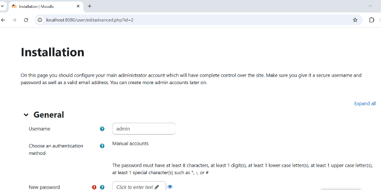

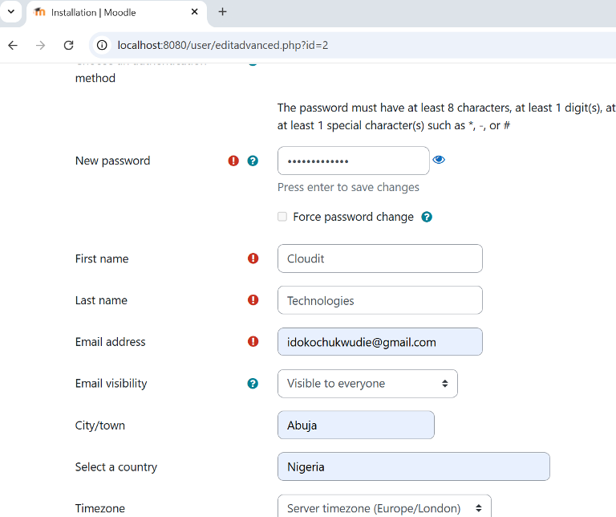

On this page you should configure your main administrator account which will have complete control over the site. Make sure you give it a secure username and password as well as a valid email address. You can create more admin accounts later on.


