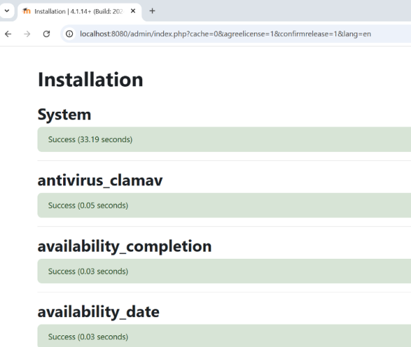
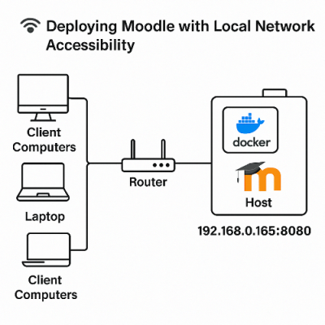
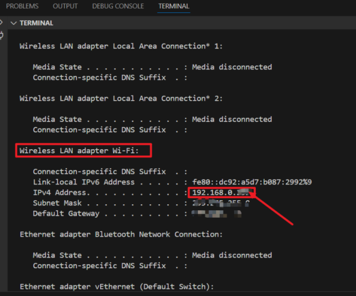
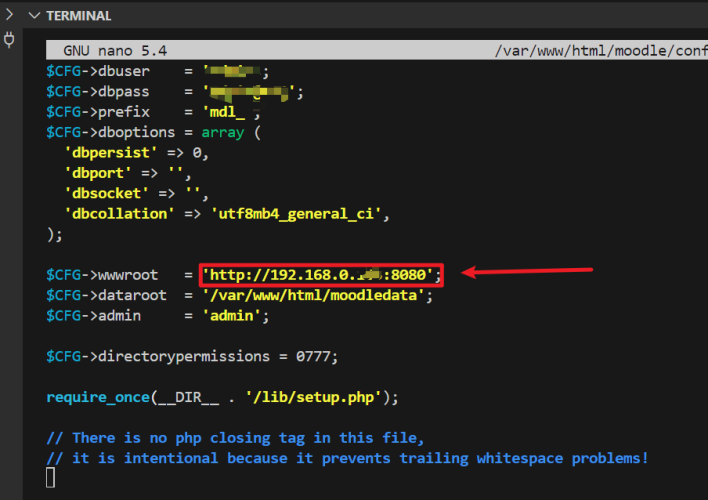
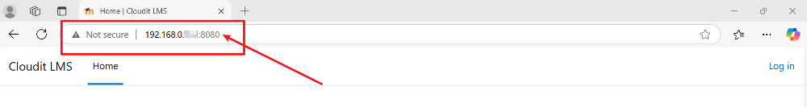

# Automating On-Premise Moodle CBT Deployment using Docker and Shell Scripting

## 🧾 Introduction
Deploying Moodle manually on bare-metal servers can be time-consuming and error-prone. This project simplifies and automates the deployment of a fully functional Moodle-based **Computer-Based Testing (CBT)** system using **Docker containers** and **Bash scripts**, making it portable, repeatable, and production-ready for on-premise use.

## 🎯 Objectives
- Automate the deployment of a custom Moodle Docker image with a MySQL backend

- Use Docker Compose to orchestrate containers efficiently

- Implement shell scripts to install, reset, and backup the CBT environment

- Ensure the system is accessible across the local network

- Troubleshoot and fix deployment issues related to Apache and volume permissions

## ⚙️ Requirements

- **Docker:**	Container engine
- **Docker Compose:**	Manage multi-container app
- **Bash Shell:**	Automate deployment with scripts
- **DockerHub Repo:**	Source of your Moodle image
- **Ubuntu Server:**	On-premise deployment environment
- **LAN Router/IP:** (To support local network access)

## 📁 FOLDER STRUCTURE

```bash
cbt-moodle-deployment/
├── .env
├── docker-compose.yml
├── install.sh
├── reset.sh
├── backup.sh
├── db-data/
└── moodle-data/   # Will be created by Docker as volume
```

## Create the structure:

## 🔐 STEP 1: `.env` File for Environment Variables

### Create a file called `.env`:

**📌 Purpose:**

This file contains environment variables used across scripts and Docker Compose. It centralizes configurations, so you don’t hard-code passwords or ports.

```bash
# MySQL configuration
MYSQL_ROOT_PASSWORD=cbtrootpass       # Root password for MySQL container
MYSQL_DATABASE=moodle                 # Database name to be created
MYSQL_USER=moodleuser                # MySQL user for Moodle
MYSQL_PASSWORD=moodlepass            # Password for the above user

# Moodle container configuration
MOODLE_PORT=8080                      # Port to access Moodle from browser

# DockerHub image
MOODLE_IMAGE=yourdockerhub/moodle-cbt:latest   # Your custom Moodle Docker image
```


## 🐳 STEP 2: `docker-compose.yml` File

**📌 Purpose:**

This file defines how Docker containers (Moodle and MySQL) will be created, configured, and connected.

```bash
version: '3.8'  # Docker Compose file format version

services:
  db:
    image: mysql:5.7                 # Use MySQL version 5.7
    container_name: moodle_db       # Container name
    restart: always                 # Always restart if container fails
    environment:                    # Pass environment variables from .env file
      MYSQL_ROOT_PASSWORD: ${MYSQL_ROOT_PASSWORD}
      MYSQL_DATABASE: ${MYSQL_DATABASE}
      MYSQL_USER: ${MYSQL_USER}
      MYSQL_PASSWORD: ${MYSQL_PASSWORD}
    volumes:
      - ./db-data:/var/lib/mysql    # Store DB data persistently in host directory

  moodle:
    image: ${MOODLE_IMAGE}           # Pull your Moodle image from DockerHub
    container_name: moodle_web
    depends_on:
      - db                           # Ensure DB starts before Moodle
    ports:
      - "${MOODLE_PORT}:80"          # Map host port to container port 80
    environment:                     # Moodle-specific DB connection variables
      MOODLE_DBTYPE: mysqli
      MOODLE_DBHOST: db              # Internal Docker name of the DB container
      MOODLE_DBNAME: ${MYSQL_DATABASE}
      MOODLE_DBUSER: ${MYSQL_USER}
      MOODLE_DBPASS: ${MYSQL_PASSWORD}
    volumes:
      - moodle-data:/var/www/html    # Volume to persist Moodle files

volumes:
  moodle-data:                       # Declare a named volume for Moodle
```


## 🚀 STEP 3: `install.sh` – Automate the Full Deployment

**📌 Purpose:**

Automates the full deployment. It:

- Loads environment variables

- Pulls your DockerHub Moodle image

- Starts services using Docker Compose

```bash
#!/bin/bash

echo "📦 Starting Moodle CBT Deployment..."

# Step 1: Load environment variables from .env file
source .env

# Step 2: Check if Docker is installed
if ! command -v docker &> /dev/null; then
  echo "❌ Docker not installed. Please install Docker."
  exit 1
fi

# Step 3: Check if Docker Compose is installed
if ! command -v docker-compose &> /dev/null; then
  echo "❌ Docker Compose not found. Install it first!"
  exit 1
fi

# Step 4: Pull Moodle image from DockerHub
echo "📥 Pulling Moodle image: $MOODLE_IMAGE"
docker pull $MOODLE_IMAGE

# Step 5: Deploy the containers
echo "🚀 Deploying containers using docker-compose..."
docker-compose up -d

echo "✅ Moodle is running at http://localhost:${MOODLE_PORT}"

chmod +x install.sh
```


## 🔁 STEP 4: `reset.sh` – Reset Environment

**📌 Purpose:**

Use this script if something goes wrong. It:

- Stops and removes containers

- Deletes MySQL data (optional)

- Redeploys Moodle

```
cat > reset.sh <<'EOF'
#!/bin/bash

echo "🧹 Resetting Moodle CBT Deployment..."

# Stop and remove containers
docker-compose down

# Optionally clear volumes
echo "🧼 Deleting MySQL data..."
rm -rf db-data/*

echo "♻️ Redeploying Moodle..."
./install.sh
EOF

chmod +x reset.sh
```

## 🗄️ STEP 5: `backup.sh` – Backup Moodle + DB Data

**📌 Purpose:**

Backs up Moodle data and MySQL database to a backup folder with date/time stamp.

```
cat > backup.sh <<'EOF'
#!/bin/bash

DATE=$(date +%Y-%m-%d_%H-%M)
BACKUP_DIR="backups/backup_$DATE"
mkdir -p $BACKUP_DIR

echo "📁 Backing up DB and Moodle data..."
cp -r db-data $BACKUP_DIR/
docker run --rm --volumes-from moodle_web -v $(pwd):/backup busybox tar czf /backup/$BACKUP_DIR/moodle-data.tar.gz /var/www/html

echo "✅ Backup complete: $BACKUP_DIR"
EOF

chmod +x backup.sh
```


## ✅ Step 7: Verify Deployment

Check if the containers are running:

```bash
docker ps -a
```


## 🌐 STEP 8: Access Moodle

```cpp
http://localhost:8080
# or use your server's IP if remote:
http://192.168.X.X:8080
```
On first launch, Moodle will guide you through setup (language, admin user, etc.).

## Error

```
Forbidden
You don't have permission to access this resource.
Apache/2.4.54 (Debian) Server at localhost Port 8080
```

means that Apache is running, but it can’t serve the Moodle application properly—usually due to a **file permission issue** or **incorrect Apache configuration** inside the container.

**Let’s fix it step by step.**

**🔍 Step 1:** Check Moodle Data Folder Permissions

Ensure the container has permission to access the mounted Moodle volume.

- Run this from your host machine:

```bash
docker exec -it moodle_web bash
```
- Then, inside the container:

```bash
ls -ld /var/www/html
```


- My moodle folder exists inside /var/www/html ✅

- The permissions are wide open (**drwxrwxrwx**), so access shouldn't be blocked by file permissions ❗

- The folder is owned by www-data, which is what Apache runs as — also ✅

**🔍 Step 2:** Check Apache Site Config

Still inside the container, run:

```bash
cat /etc/apache2/sites-enabled/000-default.conf
```

Look for the block like this:

```
<VirtualHost *:80>
    DocumentRoot /var/www/html
    ...
</VirtualHost>
```

But most importantly, look for:

```
<Directory /var/www/html>
    Options Indexes FollowSymLinks
    AllowOverride All
    Require all granted
</Directory>
```


**Directory block missing**

If it’s **missing** or says **Require all denied**, then that’s my problem.

✅ If it's pointing to /var/www/html but your Moodle is in /var/www/html/moodle, Apache doesn't serve it by default unless told to.

**🛠️ Step 3:** Fix `Apache Config`

Let’s tell `Apache` it's allowed to serve the `moodle` folder by adding a `<Directory>` directive.

Still inside your container, edit the config file:

Install Nano

```bash
apt update && apt install nano -y
```

```bash
nano /etc/apache2/sites-available/000-default.conf
```

Update the file to look like this (modified lines are marked with 🔧 for clarity — don’t add those in the real file):

```
<VirtualHost *:80>
        ServerAdmin webmaster@localhost
        DocumentRoot /var/www/html/moodle    # 🔧 Set Moodle as root

        <Directory /var/www/html/moodle>     # 🔧 Allow Apache to serve Moodle
                Options Indexes FollowSymLinks
                AllowOverride All
                Require all granted
        </Directory>

        ErrorLog ${APACHE_LOG_DIR}/error.log
        CustomLog ${APACHE_LOG_DIR}/access.log combined
</VirtualHost>
```


**💾 Save and Exit**
- Press `Ctrl + O` to save

- Press `Enter` to confirm

- Press `Ctrl + X` to exit

### 🔄 Restart Apache

Run:

```bash
service apache2 restart
```


Although it showed `Terminated`, this is normal when restarting services **inside Docker** — Apache restarted, and the process continues in the background.

**If by any chance your container has exited, you can run:**

```bash
docker start <container-id>
```

**🌐 Now Visit Moodle in Browser**

Go to:

```
http://localhost:8080
```


On first launch, Moodle will guide you through setup (language, admin user, etc.).

**NOTE:** Once you reach the stage where you're required to provide database connection details, ensure you supply the exact values from your `.env` file:

- MYSQL_DATABASE value

- MYSQL_USER value

- MYSQL_PASSWORD value

For the **Database Host**, do not leave it as the default '`localhost`'. **Replace** it with the exact value you set for the `MOODLE_DBHOST` variable.

For example, in my case, I changed '`moodle`' to '`moodle_db`' because that’s the value I assigned to `MOODLE_DBHOST`.

## ✅ Installation Completed Successfully

All components and plugins were successfully installed and configured without errors.




**Click Continue**


On this page you should configure your main administrator account which will have complete control over the site. Make sure you give it a secure username and password as well as a valid email address. You can create more admin accounts later on.

## 📡 Enable Moodle Access Across Local Network

### 🎯 Objective  
Configure the **Moodle web** application running in a **Docker container** so that client computers connected to the same local network **(via router**) can access it using the **host's IP address** instead of `localhost`.

## 🖥️ Architecture Diagram

Below is a visual representation of how your local network accesses Moodle:



Client computers connected to the same router can access the Moodle instance via the IP and port, e.g., http://192.168.0.165:8080.

---

## 🔧 Steps Implemented

1. **Identify Host IP Address**
   - Run the command to find your router-assigned IP:
     ```bash
     ipconfig
     ```
   - Locate the **IPv4 address** (e.g., `192.168.0.165`).

     

2. **Access the Moodle Container**
   - Start an interactive bash session inside the container:

     ```bash
     docker exec -it moodle_web bash
     ```

3. **Edit the Moodle Configuration File**
   - Open the config file using `nano`:
     ```bash
     nano /var/www/html/moodle/config.php
     ```
   - Locate the following line:
     ```php
     $CFG->wwwroot = 'http://localhost:8080';
     ```
   - Replace it with:
     ```php
     $CFG->wwwroot = 'http://192.168.0.165:8080';
     ```
     > ⚠️ Replace `192.168.0.165` with your actual host machine IP if different.

     

4. **Save and Exit**
   - Press `Ctrl + O` → `Enter` to save  
   - Press `Ctrl + X` to exit the editor

5. **Exit the Container**
   ```bash
   exit
   ```
6. **Restart the Moodle Container**

   From your host terminal:

    ```bash
    docker restart moodle_web
    ```

## ✅ Result
Client devices on the same `Wi-Fi` or LAN network can now access the **Moodle application** using the **host's IP address**:

📥 URL:

```
http://<host_ip address>:8080
```


The application is now reachable across my local network!

## ⚠️ Errors & Solutions

### Error:

```
Forbidden
You don't have permission to access this resource.
```

### Cause:

Apache couldn't serve Moodle due to missing `<Directory>` directives or permission issues in the container.

### Solution:

- Add the required `<Directory>` block in Apache’s config (`000-default.conf`)

- Set **DocumentRoot** to `/var/www/html/moodle`

- Restart Apache using **service apache2 restart**

**✅ Result:** Moodle becomes accessible at `http://localhost:8080`

## 🌐 Enable Moodle Access Across Local Network

To allow other systems within your LAN to access Moodle:

1. Get Local IP Address

Run:

```
ip a | grep inet
```

Note your server IP, e.g., `192.168.1.100`

2. **Ensure Firewall/Router Allows Port 8080**

- Make sure port `8080` is open on your Ubuntu firewall and router (if applicable)

Access from Another System in LAN:

```
http://192.168.1.100:8080
```

🧪 Tested successfully on multiple LAN-connected devices, confirming stable access across browsers.

# 🔐 Reset Moodle Admin Password via MySQL (Docker)

If you've forgotten the Moodle admin password while running Moodle via Docker, follow these steps:

---

## ✅ Step 1: Access the MySQL Container

```bash
docker exec -it moodle_db bash
```

---

## ✅ Step 2: Login to MySQL

```bash
mysql -u root -p
```

> Enter the root password when prompted (e.g., `Admin@123`).

---

## ✅ Step 3: Select the Moodle Database

```sql
USE moodle_db;
```

---

## ✅ Step 4: Verify the Admin User

```sql
SELECT id, username, email FROM mdl_user WHERE username = 'admin';
```

---

## ✅ Step 5: Reset the Password

Replace `newpass123` with your desired password:

```sql
UPDATE mdl_user
SET password = MD5('newpass123')
WHERE username = 'admin';
```

---

## ✅ Step 6: Exit MySQL

```sql
exit
```

---

## ✅ Step 7: Log in to Moodle

- **Username:** `admin`
- **Password:** `newpass123`

---

> ⚠️ This method uses the older MD5 hashing — secure enough for local testing. For production, use Moodle’s CLI tool or reset via email if SMTP is configured.


## ✅ Conclusion

This project delivers a modular, automated Moodle CBT system using Docker, ready for on-premise deployment. With just one script, Moodle and MySQL spin up in containers, configured securely using environment variables. From deployment to backup and reset, everything is containerized and streamlined—perfect for educational institutions, especially in LAN-first environments.